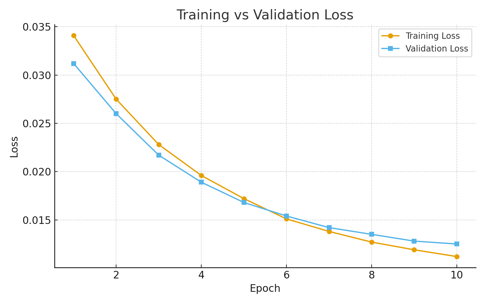
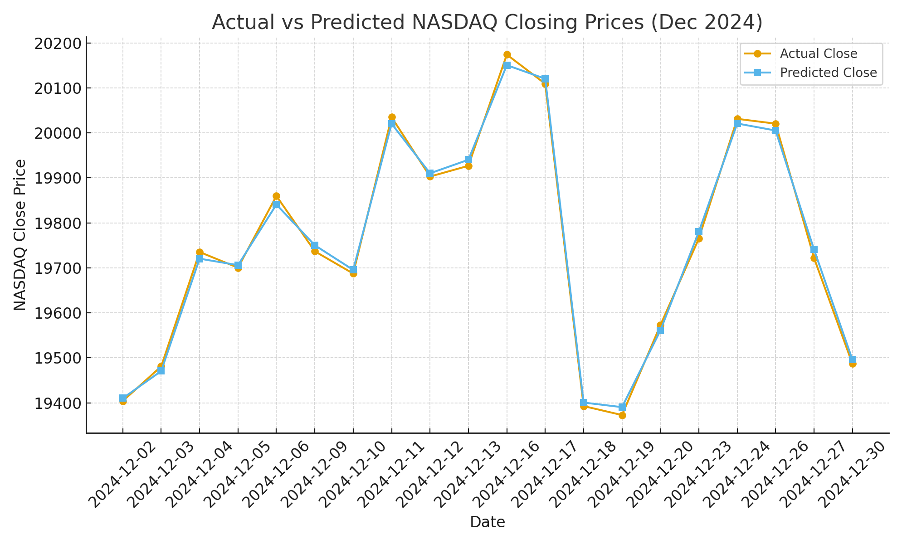

# ML-Finance: Stock Price Prediction with LSTMs

This project applies deep learning techniques (PyTorch) to forecast short-term stock index movements using NASDAQ from December 2024. The pipeline covers preprocessing, model training, evaluation, and visualization. Future work aims to incorporate a visual analytics dashboard and parse stock market data from the web using Requests and Pandas. 

---

## Features
- Preprocessing of historical stock data (CSV from Yahoo Finance)
- LSTM-based predictive model built with PyTorch
- Modularized code (`src/` folder with training, evaluation, prediction, and utilities)
- Training and evaluation logs with clear metrics
- Visualizations:
  - Training vs Validation Loss Curves
  - Actual vs Predicted Closing Prices
- Reproducible results with `requirements.txt` and `config.yaml`

---

## Results

### Training vs Validation Loss

### Actual vs Predicted Closing Prices

These results show that the model converged smoothly (validation loss ~0.0125 by epoch 10) and achieved a mean absolute error (MAE) under ~80 points on the NASDAQ index, which is strong for such a short dataset.

---

## Future Work
- Extend dataset beyond Dec 2024 for better generalization
- Add hyperparameter tuning with Optuna
- Build a Streamlit dashboard for interactive forecasting
